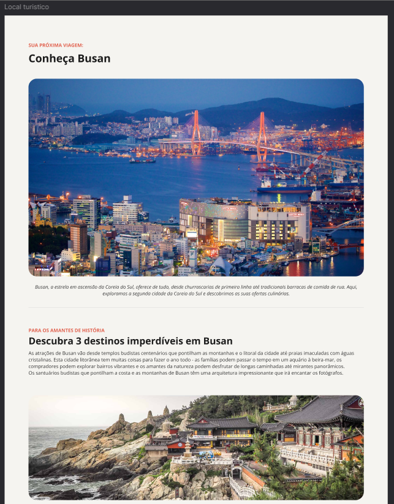

# Guia Turístico

> Página web desenvolvida para um design receptivo de um guia turístico prático para viajantes.

O foco do projeto é desenvolver um design responsivo utilizando SASS para todos os dispositivos terem a oportunidade de acessar a página combinado com o HTML semântico, e desenvolver um guia realmente prático para quem tem interesse em conhecer a Coréia do Sul.

## Meta

Gabriel C. Martins – gacmartins@gmail.com

[Meu perfil do Github](https://github.com/Gabriel-Dev-C/)

## Contributing

1. Fork it (<https://github.com/Gabriel-Dev-C/Guia-Turistico/fork>)
2. Create your feature branch (`git checkout -b feature/fooBar`)
3. Commit your changes (`git commit -am 'Add some fooBar'`)
4. Push to the branch (`git push origin feature/fooBar`)
5. Create a new _Pull Request_.
